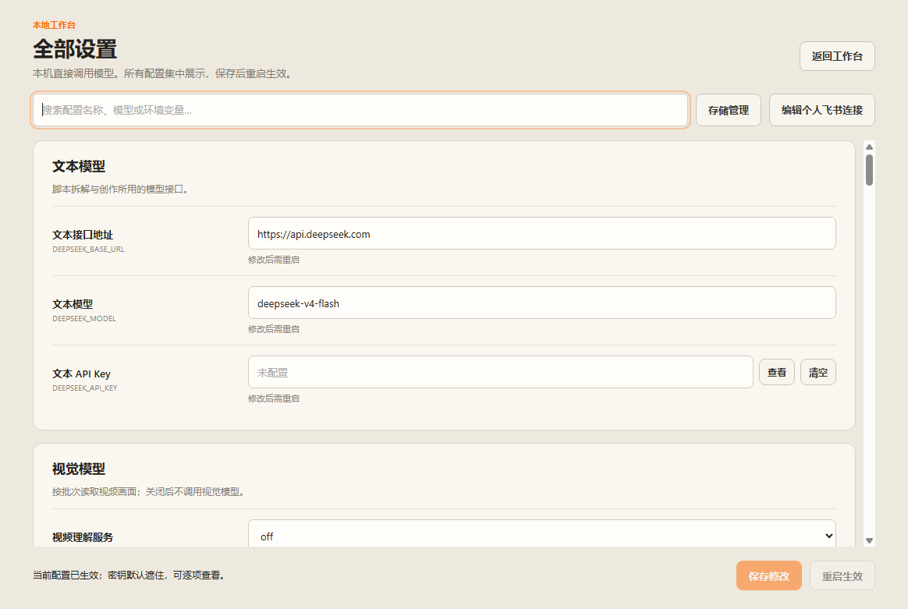

# Douyin Director · 抖音编导拆解台

[](https://github.com/R1CKYy-220/douyin-director/actions/workflows/ci.yml)
[](LICENSE)

把短视频拆成可回看的画面证据、口播时间线、内容结构和脚本参考。

一个可自行运行、修改和构建的 **Electron + Node.js 桌面工作台**。开源版默认本地直连：不需要本项目的云服务器、账户、激活码或次数充值。模型由你自己的 API 账户提供；“本地直连”是本机直接请求第三方模型，并不意味着模型权重离线运行。

[English](README.en.md) · [配置说明](docs/configuration.md) · [开发与架构](docs/development.md) · [隐私与数据](docs/privacy.md) · [参与贡献](CONTRIBUTING.md)



## 能做什么

- 从抖音分享链接、作品链接或视频直链创建分析任务。
- 使用独立抖音登录窗口获取正常播放的视频；提取音频、按时间抽帧。
- 分批分析全部提取画面，展示覆盖率和可回看的关键帧。
- 语音识别与口播时间线、结构分析、HTML 编导报告。
- 根据产品信息仿写脚本，检索素材并辅助创作；可选连接个人飞书多维表格。
- 在设置页查看全部配置，修改模型、接口地址、抽帧和下载参数；密钥遮密展示、系统加密保存。
- 管理本地任务目录与缓存。开源版使用独立资料目录，不覆盖旧商业版数据。

当前主要支持 **Windows 10/11 x64**。核心测试可在 Windows/Linux 运行；macOS/Linux 桌面发行暂未验证。软件用于分析与脚本辅助，不生成视频成片。抖音下载依赖平台当前行为、你的登录状态和作品访问权限。

## 从源码运行

也可以从 [GitHub Releases](https://github.com/R1CKYy-220/douyin-director/releases/latest) 下载 Windows 安装包及 SHA-256 校验文件。安装包无需另装 Node.js，但仍需 FFmpeg 和自己的模型 API Key。

准备 Node.js 22 或更新版本、Git，以及可执行的 FFmpeg。

1. 从 [FFmpeg 官方下载入口](https://ffmpeg.org/download.html) 选择适合系统的构建，将其 `bin` 目录加入 `PATH`。也可以稍后在设置页填写 `ffmpeg.exe` 的完整路径。
2. 克隆并安装：

```powershell
git clone https://github.com/R1CKYy-220/douyin-director.git
cd douyin-director
npm ci
Copy-Item .env.example .env
npm run doctor
npm start
```

`npm ci` 会安装 Electron；如下载失败，参见 [Electron 官方安装排查](https://www.electronjs.org/docs/latest/tutorial/installation)。运行环境检查不会读取桌面端加密配置，因此首次使用时显示“未配置密钥”正常。

3. 点击右上角 **设置**，填写文本模型、视觉模型、语音识别服务的 API Key，检查模型名称是否是你的账户支持的名称，保存后重启。
4. 点击 **登录抖音**，确认目标作品可正常播放。粘贴分享链接并开始分析。

使用默认能力配置时，需要 DeepSeek 文本、MiniMax 视觉和火山 ASR 的可用账户。模型和接口地址可修改；各服务的可用性、额度和费用由供应商账户决定。未配置语音识别时可降级；要求完整口播时在设置中开启“要求有效语音识别”。飞书连接是可选项。

## Windows 构建

```powershell
npm ci
npm test
npm run build:desktop
```

输出位于 `dist/`。`npm run build:dir` 只生成解包后的应用目录，便于本地验证。构建脚本只生成公开默认配置，不读取你的 `.env` 或桌面密钥。

安装包包含 Electron，不附带 FFmpeg、Python 或第三方下载器。使用者仍须自行安装 FFmpeg。默认桌面下载路径不需要 Python。发行构建未配置代码签名，Windows 可能提示未知发布者。

## 项目状态与测试

1.7.0 是从实际使用的桌面工作台整理出的首个开源版本。核心功能保留，旧云服务部署资料、用户素材、账户数据库和凭据均不属于本仓库。旧账户/计费适配代码仅作为兼容代码保留，开源默认配置不会启用它们；本仓库不承诺旧商业云服务可用。

```powershell
npm test                 # 离线功能与回归测试，不调用付费模型
npm run check:public     # 检查待公开文件、敏感凭据格式与本机路径
npm run test:desktop     # Windows 原生界面测试，使用独立测试资料目录
node scripts/test-media.mjs  # 可选：安装 FFmpeg 后验证合成视频抽帧与音频提取
```

CI 在 Windows/Linux 运行离线测试，并在 Windows 验证界面及打包。测试覆盖配置加密、密钥脱敏、下载路由、抽帧覆盖、语音请求、报告清洗、素材结构、存储保护和本地访问令牌。

## 参与与许可

欢迎提交复现问题、文档修正和功能 PR。见 [贡献指南](CONTRIBUTING.md) 和 [开发说明](docs/development.md)。安全问题请勿附带实际密钥或用户素材公开提交，见 [安全政策](SECURITY.md)。

项目自有代码使用 [MIT 许可证](LICENSE)。第三方依赖保留各自许可证，见 [第三方说明](THIRD_PARTY_NOTICES.md)。本项目与抖音、DeepSeek、MiniMax、火山引擎或飞书无官方关联。请只处理你有权使用的内容。
